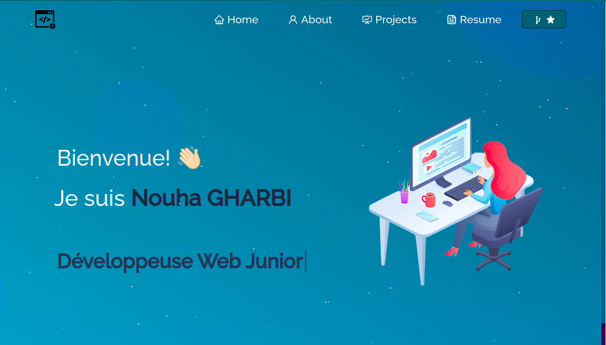

<h2 align="center">
  Portfolio Website - v1.0 
  <a href="https://nagharbi-portfolio.web.app/" target="_blank">nagharbi</a>
</h2>

  

 

<h3 align="center">
    🔹
    <a href="https://github.com/nagharbi/portfolio-nouha/issues">Rapportez une erreur</a> &nbsp; &nbsp;
    🔹
    <a href="https://github.com/nagharbi/portfolio-nouha/issues">Demander une fonctionnalité</a>
</h3>

## Construit avec

Mon portfolio personnel <a href="https://nagharbi-portfolio.web.app/" target="_blank">nagharbi</a> qui présente certains de mes projets github ainsi que mon CV et mes compétences techniques. 

Ce projet a été construit en utilisant ces technologies.

- React.js
- Node.js
- Express.js
- CSS3
- VsCode

## Features

**📖 Multi-Page Layout**

**🎨 Styled with React-Bootstrap and Css with easy to customize colors**

**📱 Fully Responsive**

## Getting Started

Vous aurez besoin de `node.js` et `git` installé globalement sur votre machine.

## 🛠 Instructions d'installation et de configuration

1. Installation: `npm install`

2. Dans le répertoire du projet, vous pouvez exécuter : `npm start`

Exécute l'application en mode développement.\
Ouvrir [http://localhost:3000](http://localhost:3000) pour le voir dans le navigateur.
La page se rechargera si vous apportez des modifications.

## Mode d'emploi

Ouvrez le dossier du projet et accédez à `/src/components/`.  
Vous retrouverez tous les composants utilisés et vous pourrez modifier vos informations en conséquence.
